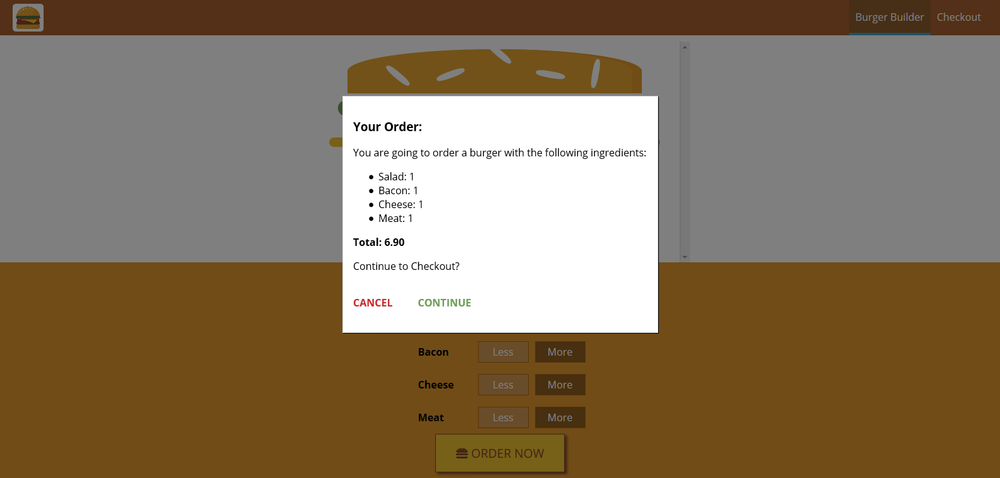
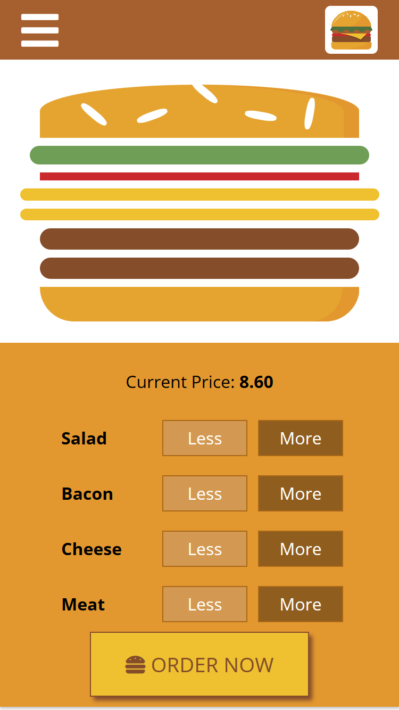
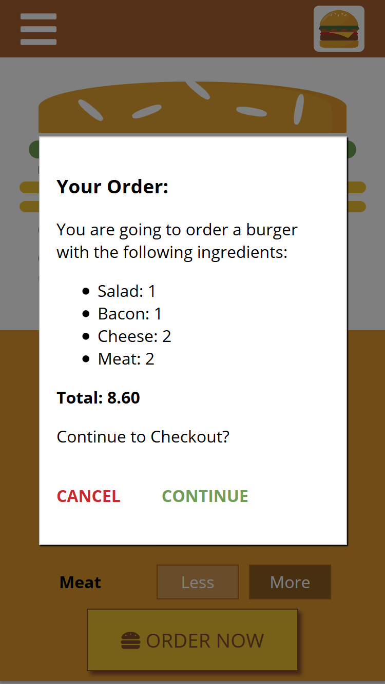

# Burger builder application

## 1. LIVE DEMO: https://karolsz15burger.web.app

## 2. DESCRIPTION

Burger order application created with React and Redux. User is allowed to add and subtract the burger's ingredients and the burger's preview is then presented in the real time. The users can make orders and see their orders' history.
The app is fully responsive, it works properly on desktop and mobile phones.

## 3. SCREENSHOTS:

### 1. Desktop view
 

### 2. Desktop view - popup modal
 

### 3. Mobile - landsape view
 

### 4. Mobile - portrait view
 

### 5. Mobile - popup modal view
 
